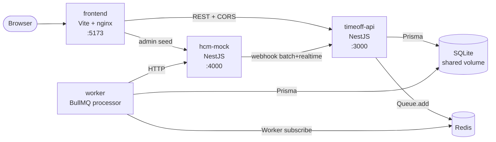
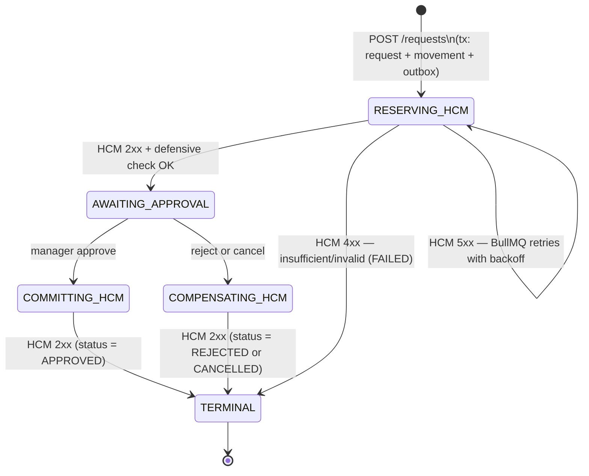
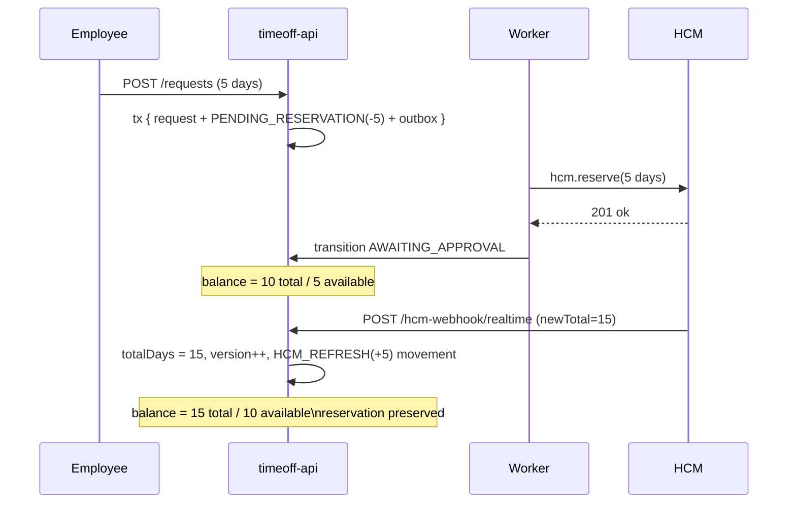
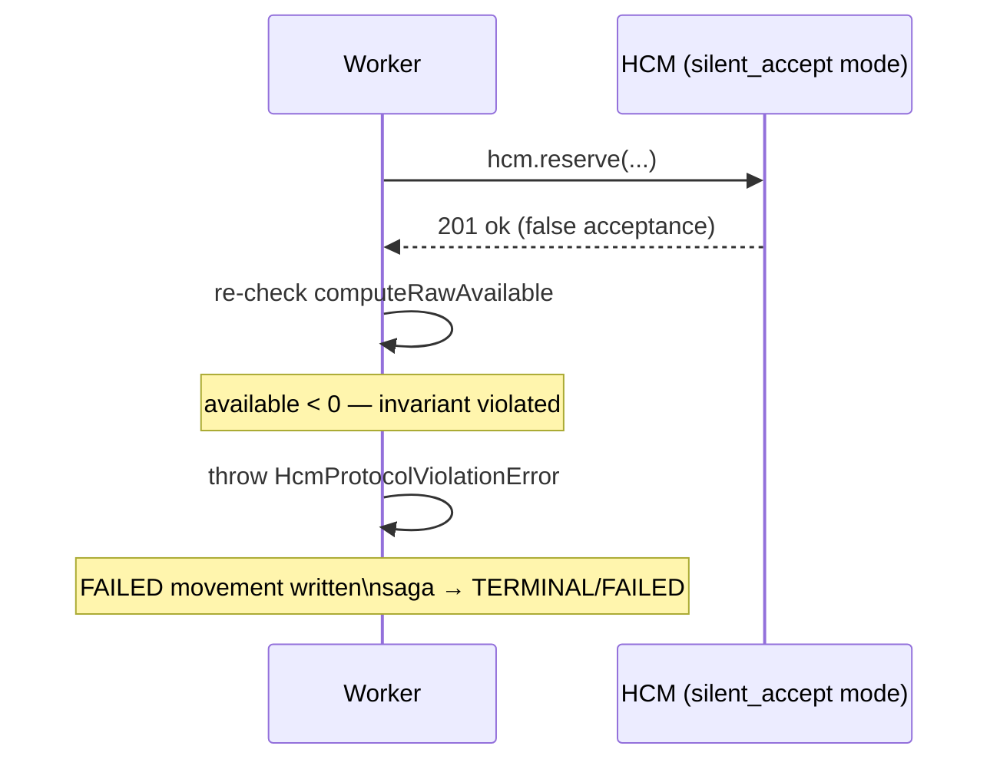

# ExampleHR Time-Off Microservice

A NestJS + SQLite microservice that manages the full lifecycle of employee time-off requests while keeping balance integrity with an external HCM system (Workday/SAP class). What makes it interesting: a transactional outbox pattern drives all HCM interactions, a movement-ledger derives available balance dynamically (so in-flight reservations survive HCM batch refreshes), and a defensive re-validation layer catches the case where HCM silently accepts an invalid request.

## Table of contents

- [Quick start](#quick-start)
- [Architecture](#architecture)
- [Saga lifecycle](#saga-lifecycle)
- [Drift handling](#drift-handling)
- [Defensive HCM validation](#defensive-hcm-validation)
- [RBAC model](#rbac-model)
- [How to use the UI](#how-to-use-the-ui)
- [How to use the API](#how-to-use-the-api)
- [Tests](#tests)
- [Project layout](#project-layout)
- [Design docs](#design-docs)
- [Out of scope](#out-of-scope)
- [Troubleshooting](#troubleshooting)

---

## Quick start

```bash
pnpm install
docker compose up --build
```

Open **http://127.0.0.1:5173** (use `127.0.0.1`, not `localhost` — see [Troubleshooting](#troubleshooting)).

| URL | Purpose |
|---|---|
| http://127.0.0.1:5173 | Frontend UI |
| http://127.0.0.1:3000 | timeoff-api REST API |
| http://127.0.0.1:3000/docs | Swagger UI |
| http://127.0.0.1:3000/health | Liveness |
| http://127.0.0.1:3000/health/ready | Readiness (db + redis + hcm) |
| http://127.0.0.1:4000 | HCM mock |

Stop and clear all state:

```bash
docker compose down -v
```

---

## Architecture

Five services, one `docker compose up`:



The `api` and `worker` containers share the same NestJS image — `ROLE=api` closes the BullMQ consumer on boot, `ROLE=worker` skips the HTTP listener. Both access the same SQLite file via a shared volume.

### Bounded contexts in `timeoff-api`

| Module | Responsibility |
|---|---|
| `balances` | Read model: derives `available = totalDays − Σ(pending + confirmed movements)` |
| `requests` | CRUD + saga orchestration; state machine enforces valid transitions |
| `outbox` | Transactional outbox: stages HCM calls atomically with business writes, dispatches to BullMQ |
| `reconciliation` | Batch and realtime HCM ingestion; timestamp-based merge preserves in-flight reservations |
| `hcm-client` | `HcmPort` interface with HTTP adapter (production) and InMemory adapter (tests) |
| `employees` | Employee table, seeder, team-aware queries used by RBAC |
| `health` | Liveness (`/health`) and readiness (`/health/ready` — probes DB, Redis, HCM) |

---

## Saga lifecycle

Each time-off request drives a saga through the following states:



Key design points:

- **Transactional outbox.** Every state-changing HCM call (`RESERVE_HCM`, `CONFIRM_HCM`, `COMPENSATE_HCM`) is written to the `OutboxEntry` table in the same Prisma transaction as the business record. A poller picks pending entries and pushes them to BullMQ. No dual-write hazard.
- **Idempotent workers.** Each BullMQ handler reads `sagaState` first and no-ops if the request is already terminal or in a different state. Safe on replay.
- **TERMINAL** means the request reached `APPROVED`, `REJECTED`, `CANCELLED`, or `FAILED`. Every non-approved terminal path writes a `CANCELLED` movement that offsets the original `PENDING_RESERVATION`, restoring available balance.
- **Retry + DLQ.** BullMQ retries with exponential backoff (1 s, 5 s, 25 s, 2 min, 10 min) before landing in the dead-letter queue. Operators can call `POST /requests/:id/force-fail` to manually recover a stuck saga.

---

## Drift handling

HCM may update balances independently (work-anniversary credits, year-start resets). The system survives drift because `available` is derived at read time — it is never stored:

```
available = Balance.totalDays − Σ(movements where type ∈ {PENDING_RESERVATION, CONFIRMED})
```

When a batch or realtime webhook arrives, reconciliation updates `totalDays` and records an `HCM_REFRESH` movement for the audit trail. In-flight `PENDING_RESERVATION` movements are untouched, so existing requests remain valid.



Reconciliation skips rows where the incoming `hcmTimestamp` is older than `Balance.hcmLastSeenAt` — stale pushes are ignored.

---

## Defensive HCM validation

The PDF notes that HCM error reporting "may not always be guaranteed". After every HCM reserve acknowledgement, the worker re-computes `computeRawAvailable` locally. If the result is negative, HCM lied — the saga fails immediately.



The `HcmProtocolViolationError` is logged with full context and bubbles as a non-retryable failure. Proof test T-6 (`test/integration/requests/defensive-hcm.spec.ts`) exercises this path using the HCM mock's `silent_accept` injection mode.

---

## RBAC model

Authentication is delegated to an upstream gateway (out of scope). The service receives trusted headers `x-employee-id` and `x-role` on every request.

| Role | Can read | Can write | Notes |
|---|---|---|---|
| `employee` | Own balance; own requests | Create requests; cancel own pending requests | Cannot read other employees' data |
| `manager` | Own + direct-reports' balances; own + direct-reports' requests | Approve/reject direct-reports' requests | Team = employees where `managerId = manager.id` |
| `admin` | Everyone's data | Everything: force-fail, employee CRUD, HCM webhooks | Full access |

Implementation references:
- API: `RolesGuard` + `@Roles()` decorator per endpoint (`apps/timeoff-api/src/shared/auth/`)
- API: ownership / team checks in `BalancesController.list` and `RequestsController.list`, `.approve`, `.reject`
- Frontend: `RequireAuth` component with optional `roles` array (`apps/frontend/src/components/RequireAuth.tsx`)
- Frontend: nav links visible only for roles that have the page (Employee always, Manager/Admin for manager+admin)

---

## How to use the UI

1. Open **http://127.0.0.1:5173** — the app redirects to `/login`.
2. The login screen shows all seeded employees (Alice Admin, Mary Manager, Eddie Employee, Emma Employee). Click any name to "sign in" as that identity.
3. **First time only:** click **Alice Admin** to go to `/admin`. Click **"Run one-click demo setup"** — this seeds 10 days in the HCM mock and pushes the balance to the API for every employee. This step is required before employees can submit requests.
4. Click **Sign out** (the identity switcher in the top-right) and log back in as **Eddie Employee**.
5. On the Employee page, you will see Eddie's balance (10 days / l1). Fill in start date, end date, and click **Submit**.
6. The saga state auto-refreshes every 2 seconds: RESERVING_HCM → AWAITING_APPROVAL.
7. Sign out and log in as **Mary Manager** (Eddie's manager). On the Manager page, Eddie's request appears. Click **Approve** or **Reject**.
8. After approval, return to Eddie's page — balance reflects the confirmed deduction.
9. The Admin page also shows all requests with a **Force-fail** button for stuck sagas, and individual HCM seed / realtime-webhook controls for manual testing.

---

## How to use the API

Swagger UI is available at **http://127.0.0.1:3000/docs**.

All protected endpoints require `x-employee-id` and `x-role` headers.

```bash
# Public — employee directory (used by the login screen)
curl http://127.0.0.1:3000/employees/directory

# Own profile
curl http://127.0.0.1:3000/employees/me \
  -H 'x-employee-id: <id>' -H 'x-role: employee'

# Seed initial balance (admin only)
curl -X POST http://127.0.0.1:3000/hcm-webhook/realtime \
  -H 'x-employee-id: <admin-id>' -H 'x-role: admin' \
  -H 'content-type: application/json' \
  -d '{"employeeId":"<emp-id>","locationId":"l1","newTotal":"10","hcmTimestamp":"2026-01-01T00:00:00Z"}'

# Read balance
curl http://127.0.0.1:3000/balances/<employeeId> \
  -H 'x-employee-id: <id>' -H 'x-role: employee'

# Submit a time-off request
curl -X POST http://127.0.0.1:3000/requests \
  -H 'x-employee-id: <emp-id>' -H 'x-role: employee' \
  -H 'content-type: application/json' \
  -d '{"locationId":"l1","startDate":"2026-05-01","endDate":"2026-05-03","idempotencyKey":"unique-key-1"}'

# Approve (manager or admin)
curl -X POST http://127.0.0.1:3000/requests/<id>/approve \
  -H 'x-employee-id: <manager-id>' -H 'x-role: manager'

# Reject
curl -X POST http://127.0.0.1:3000/requests/<id>/reject \
  -H 'x-employee-id: <manager-id>' -H 'x-role: manager' \
  -H 'content-type: application/json' \
  -d '{"reason":"dates conflict with team coverage"}'

# Force-fail a DLQ'd saga (admin recovery)
curl -X POST http://127.0.0.1:3000/requests/<id>/force-fail \
  -H 'x-employee-id: <admin-id>' -H 'x-role: admin' \
  -H 'content-type: application/json' \
  -d '{"reason":"manual ops recovery"}'

# HCM batch webhook (admin only)
curl -X POST http://127.0.0.1:3000/hcm-webhook/batch \
  -H 'x-employee-id: <admin-id>' -H 'x-role: admin' \
  -H 'content-type: application/json' \
  -d '{"rows":[{"employeeId":"<id>","locationId":"l1","totalDays":"15","hcmTimestamp":"2026-04-22T00:00:00Z"}]}'
```

Error responses follow RFC 7807:

```json
{
  "type": "https://examplehr/errors/insufficient-balance",
  "title": "Insufficient balance",
  "detail": "Available 3 day(s); requested 5.",
  "code": "INSUFFICIENT_BALANCE",
  "correlationId": "..."
}
```

---

## Tests

```bash
pnpm test:unit            # ~10 s, no infra required
pnpm test:integration     # ~60 s, uses SQLite + spawns hcm-mock for one suite
pnpm test:property        # ~12 s, fast-check property tests

# Smoke test — requires running stack
docker compose up -d --wait && pnpm test:smoke && docker compose down -v
```

| Layer | Suites | Tests | What it proves |
|---|---|---|---|
| Unit | 7 | 29 | Pure-domain logic: balance calculator, saga state machine, request validator, error hierarchy, in-memory HCM adapter, trusted-headers guard, reconciliation merger |
| Integration | 18 | 48 | Module + DB + mocked HcmPort: repositories, services, controllers (supertest), BullMQ processor via `proc.process(fakeJob)`. All 6 proof tests T-1..T-6 are here. |
| Property-based | 2 | 2 | `fast-check` random action sequences assert `available >= 0` invariant; 50-concurrent race proves no oversell |
| Smoke | 1 | — | Full HTTP flow against docker-compose: seed → request → approve → balance reflects |

**Six named proof tests:**

| ID | Scenario | File |
|---|---|---|
| T-1 | Race condition — 50 concurrent requests on balance=10; exactly 10 succeed | `test/property/race-condition.spec.ts` |
| T-2 | Drift survival — HCM batch refresh preserves in-flight reservation | `test/integration/reconciliation/drift-survival.spec.ts` |
| T-3 | HCM unavailable — 503 retried; recovery after mock restored | `test/integration/workers/hcm-unavailable-recovery.spec.ts` |
| T-4 | Idempotency — 5 concurrent same key → exactly 1 request | `test/integration/requests/idempotency.spec.ts` |
| T-5 | Saga compensation / DLQ — force-fail releases reservation | `test/integration/requests/dlq-recovery.spec.ts` |
| T-6 | Defensive HCM — `silent_accept` caught as `HcmProtocolViolationError` | `test/integration/requests/defensive-hcm.spec.ts` |

The property-based test caught a real bug during development: when HCM pushed `totalDays` below pending reservations, `computeRawAvailable` returned a negative value. Fix: raw value is used for the defensive check; the gating/display path clamps at 0.

---

## Project layout

```
apps/
  timeoff-api/
    src/
      modules/
        balances/           read model + ledger derivation
        requests/           CRUD + saga orchestration
          domain/           saga-state-machine.ts, request-validator.ts
        reconciliation/     batch + realtime HCM ingestion
          domain/           reconciliation-merger.ts
        outbox/             transactional outbox + BullMQ dispatcher
        hcm-client/         HcmPort interface + Http/InMemory adapters
        employees/          Employee table, seeder, team queries
        health/             liveness + readiness
      shared/
        auth/               TrustedHeadersGuard, RolesGuard, @CurrentUser
        context/            ALS-based correlation middleware
        errors/             DomainError hierarchy + RFC 7807 filter
        logging/            Pino JSON setup
        prisma/             PrismaService (WAL + BEGIN IMMEDIATE)
      workers/
        hcm-saga.processor.ts   single BullMQ processor for all job types
      main.ts               HTTP server entrypoint
      worker.ts             BullMQ worker entrypoint
    test/
      unit/                 pure logic, no I/O
      integration/          module + DB + mocked HcmPort
      property/             fast-check invariants + race condition
      smoke/                full-stack HTTP test
    prisma/
      schema.prisma
      migrations/
  hcm-mock/
    src/
      hcm/                  reserve, confirm, release, getBalance endpoints
      admin/                /_admin/seed, /_admin/set-mode (failure injection)
  frontend/
    src/
      pages/                Login, Employee, Manager, Admin
      components/           ErrorBoundary, RequireAuth, RequestList, IdentitySwitcher
      api.ts                typed fetch wrapper
      auth.ts               identity state (localStorage)

packages/
  contracts/                shared DTOs + enums (HcmBatchPayload, Role, SagaState, ...)

docs/
  superpowers/
    specs/                  TRD (2026-04-22-examplehr-timeoff-design.md)
    plans/                  implementation plan (2026-04-22-examplehr-timeoff.md)
  PDF_COMPLIANCE.md         this audit
```

---

## Design docs

- **TRD:** [`docs/superpowers/specs/2026-04-22-examplehr-timeoff-design.md`](docs/superpowers/specs/2026-04-22-examplehr-timeoff-design.md) — problem framing, domain model, saga state machine, reconciliation algorithm, alternatives considered (§8), observability (§9), failure modes (§10).
- **Implementation plan:** [`docs/superpowers/plans/2026-04-22-examplehr-timeoff.md`](docs/superpowers/plans/2026-04-22-examplehr-timeoff.md) — phased build order with acceptance criteria per phase.
- **PDF compliance audit:** [`docs/PDF_COMPLIANCE.md`](docs/PDF_COMPLIANCE.md) — cross-references every PDF requirement against the actual implementation with file-level evidence.

---

## Out of scope

Per TRD §12, the following are explicitly not built:

- Authentication/JWT/SSO/password management — delegated to upstream gateway (trusted headers only).
- Multi-tenant isolation.
- Real HCM integration (Workday/SAP) — only the mock server.
- `GET /balances/:id?strategy=fresh` — force-refresh before responding (marginal correctness gain over webhook-driven total).
- No-overlap validation — requests that overlap existing APPROVED dates are not blocked at the API layer.
- Prometheus `/metrics` exposition — metric names are defined in the TRD but the endpoint is not wired.
- Notification channels (email, push) on approval/rejection.
- Production-grade secrets management (env vars only).
- Per-module Jest coverage thresholds — a single global threshold is enforced.

---

## Troubleshooting

**`localhost` vs `127.0.0.1`**
On Windows with Docker Desktop, the browser may resolve `localhost` to `::1` (IPv6) while the containers listen on `0.0.0.0` (IPv4). Always use `http://127.0.0.1:5173` / `http://127.0.0.1:3000`.

**"database is locked" error**
Do not restart the `api` container alone — SQLite WAL mode requires both the `api` and `worker` to reconnect together. Run `docker compose down && docker compose up --build` to get a clean state.

**Stale browser cache after redeploy**
The frontend is served by nginx with standard caching headers. After a full redeploy, hard-refresh with **Ctrl+Shift+R** (Windows/Linux) or **Cmd+Shift+R** (macOS).

**Employee with duplicate email returns 409**
Each employee email must be unique (`email` has a unique index). The seed (Alice/Mary/Eddie/Emma) runs once on first boot; restarting does not re-insert. If you need to reset, run `docker compose down -v` to clear the SQLite volume.

**Property test exits with "Jest did not exit" warning**
This is a known cosmetic issue: the BullMQ client in the race-condition test holds a Redis connection open after tests finish. All tests pass; the warning does not indicate a failure. Use `--forceExit` to suppress it: `pnpm --filter timeoff-api exec jest --testPathPattern=test/property --forceExit`.
